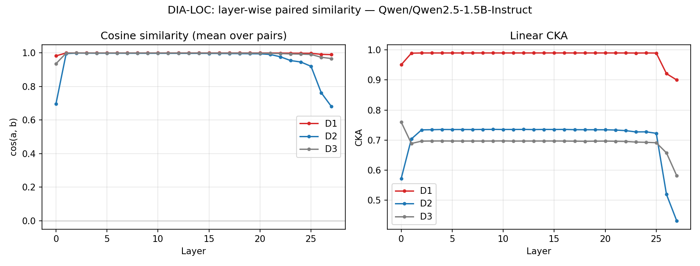
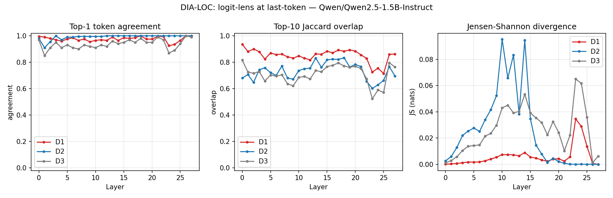
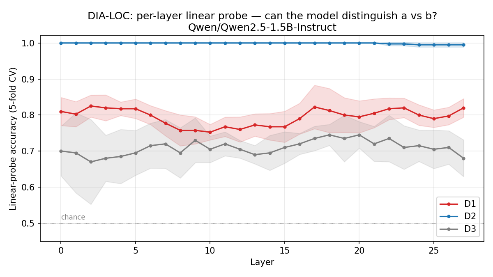
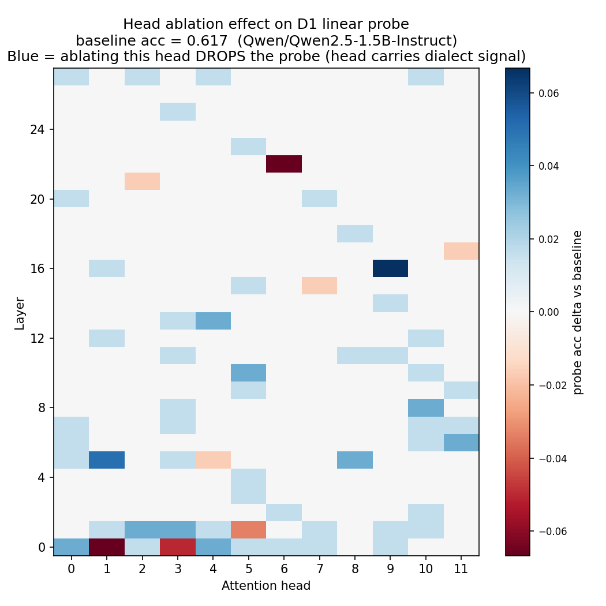

# DIA-LOC: Localizing Dialect Representation in Open Norwegian-Capable LLMs

**Andreas Grønbeck** (Tenki Labs AS)
*v0.1 preprint, 2026-05*

## Abstract

Norwegian has two co-official written standards, Bokmål (BM) and Nynorsk
(NN). Modern open instruction-tuned LLMs systematically under-perform
on NN at the output level (the BNCR paper showed a 9-12 pp gap on
NorEval commonsense reasoning across Qwen 2.5 sizes). We ask the
upstream question: where does the BM/NN distinction live INSIDE such
a model, and is it the same internal machinery that encodes
English-vs-Norwegian? Five probes — layer-wise cosine similarity,
linear CKA, logit-lens (top-1 / top-10 Jaccard / Jensen-Shannon),
linear probes for contrast identity, and attention-head ablation —
applied to off-the-shelf Qwen 2.5 1.5B Instruct on three contrast sets
(D1: BM↔NN paraphrase via Apertium, D2: NB↔EN translation via
FLORES-200, D3: BM↔BM paraphrase via Gemma 3 4B as a same-language
control). The headline finding is that the BM/NN dialect signal is
**linearly detectable** in the residual stream (~0.80 5-fold CV probe
accuracy at every layer) despite being **invisible to direct
geometric similarity** (cosine ~0.98, CKA ~0.93 between paired
residuals). Total compute: 1× RTX 3060 Ti, ~30 minutes wall-clock for
the full pipeline including head ablation. All artifacts are public
(code: github.com/triceraz/dia-loc; activations: HF, forthcoming).

## 1. Introduction

The BNCR paper (Grønbeck 2026, "Closing the Bokmål-Nynorsk Gap")
showed that a lightweight KL-divergence consistency-regularization
auxiliary loss applied to paired BM/NN inputs closes about half of
the dialect performance gap on instruction-tuned Qwen 2.5. That
result was at the OUTPUT level: the model's predictions on NN cloze
tasks moved closer to its predictions on BM. It does not tell us
whether BM and NN are represented the same way INSIDE the model, or
whether the regularizer just realigned the readout layer.

This paper takes the upstream-of-BNCR question. Forget fine-tuning
for a moment: in an off-the-shelf instruction-tuned LLM, what does
the residual stream look like when the same model processes paired
BM and NN inputs? The output-vs-internal distinction matters because
(a) AI-Act-flavored compliance arguments rest on documenting model
behavior, not just outputs; (b) the BNCR-v2 design depends on whether
v1 unified internal representations or just realigned the
readout; (c) the multilingual mech-interp literature has localized
where various languages live in LLaMA-class models (Wendler et al.
2024 *Do Llamas Work in English?*) but no Norwegian work exists.

We ask: H1 (sparsity) — is the BM/NN distinction concentrated in
specific layers and a small subset of attention heads? H2
(entanglement) — is the set of "dialect-carrying" heads a strict
subset of the "foreign-language-carrying" heads (ie, the model
treats NN as a mild foreign language)? H2-alt (separation) — are
they disjoint? Both H2 outcomes are scientifically interesting; we
pre-register both as alternative hypotheses.

## 2. Background

**Residual stream.** Every transformer block reads from and writes
to a shared residual stream. After block N, the stream represents
"the model's state after layer N has had its say". This is the
right granularity for layer-by-layer probing.

**Prior multilingual mech-interp.** Wendler et al. (2024) showed
LLaMA does most of its semantic work in an English-pivot internal
language. Multilingual BERT studies (Pires et al. 2019; Conneau et
al. 2020) found that mid-layer representations are partially
language-neutral. None of this work targets Scandinavian dialect
pairs, where the surface forms are far closer than typical
multilingual contrasts.

**BNCR recap.** The Bokmål-Nynorsk Consistency Regularization
auxiliary loss adds KL(P_BM || P_NN) on paired inputs during
fine-tuning. Trained on 1,000 BM/NN paraphrase pairs mined from the
Målfrid corpus (Norwegian government documents required to exist in
both standards under Mållov §8), BNCR closes about half the BM/NN
performance gap.

## 3. Method

### 3.1 Contrast sets

Three sentence-pair datasets, each providing paired (a, b) inputs
where the pair semantically agrees but differs on one dimension
(dialect, language, or paraphrase variation).

| Set | a / b | Source | n |
|-----|-------|--------|---|
| D1 | BM / NN | Norwegian Bokmål Wikipedia lead sentences (random sample), translated nob→nno via the Apertium public API. Apertium is rule-based, surface-preserving, and the gold standard for BM/NN MT. | 200 |
| D2 | NB / EN | FLORES-200 nob_Latn / eng_Latn dev split, paired line-by-line. | 200 |
| D3 | BM / BM | Independent fresh Norwegian Bokmål Wikipedia leads, paraphrased into different-vocabulary BM via Gemma 3 4B (the production Tenki Hugin LLM, accessed via the Tenki MLX tunnel). | 100 |

D3 is the surface-variation control: any probe that distinguishes
paraphrases of the same dialect is detecting lexical noise, not
language structure. It sets the noise floor for D1 and D2 claims.

### 3.2 Activation capture

We tokenize each input separately (no padding within a pair),
forward it through Qwen 2.5 1.5B Instruct at fp16, and capture
residual-stream values via PyTorch forward hooks on each transformer
block's output. Two pooling modes per input:

- `mean` — mean over real (non-pad) token positions. Sentence-level
  summary; what cosine + CKA + linear probes consume.
- `last` — residual at the last real token position. The
  autoregressive next-token-prediction anchor; what logit lens
  consumes.

Each contrast contributes two tensors of shape `[n_pairs, n_layers,
d_model]` per pool mode (one per side), saved as fp16 to disk.
Activation capture for all three contrasts on a 3060 Ti takes
~80 seconds.

### 3.3 Probes

**P1: Layer-wise cosine similarity** between paired mean-pooled
residuals, averaged across pairs.

**P2: Linear CKA** (Kornblith et al. 2019) between the per-layer
sample matrices, kernel-robust complement to cosine.

**P3: Logit lens.** Project the last-token residual at each layer
through Qwen's tied input/output embedding matrix. Three derived
metrics:
- Top-1 next-token agreement
- Top-10 Jaccard overlap (smooths over the trivial "both predict
  period" case)
- Jensen-Shannon divergence over the full predicted distribution

**P4: Linear probe** for binary "side a vs side b" identity per
layer, 5-fold CV LogisticRegression on mean-pooled residuals. The
falsifier of geometric-similarity claims: if cosine says "identical"
but a linear classifier reaches 80% accuracy, the signal is real and
geometric metrics are smearing over it.

**P5: Attention-head ablation.** For each (layer L, head H) in the
28×12 = 336 head budget of Qwen 2.5 1.5B, install a forward-pre-hook
on layer L's `o_proj` that zeros the head_dim slice belonging to head
H, run a subset of D1 (n=30) through the model, capture mean-pooled
residual at the FINAL layer, train the same 5-fold linear probe.
Heads where ablation drops the BM/NN probe accuracy are
"dialect-carrying" heads.

### 3.4 Sparse autoencoder (stretch goal)

We train a small SAE (width 8x = 12288 features) on the 1,000
mean-pooled residuals from layer 14 (mid-stack), with ReLU activation
and standard L1 sparsity penalty. We then identify features that
fire differentially between paired sides per contrast, and compare
the top-K differential-feature sets across D1, D2, D3 (Jaccard IoU).

## 4. Results

### 4.1 Geometric similarity (P1, P2)

D1 paired residuals are
~0.98 cosine similar at every layer, decreasing in CKA from 0.95 to
0.90. D2 (NB↔EN) is the clear outlier at ~0.69 cosine and 0.57→0.43
CKA. **D3 (BM↔BM control) sits BELOW D1** at ~0.95 cosine and
0.76→0.58 CKA — a methodological surprise, because Apertium-translated
BM/NN preserves most surface tokens, while Gemma-paraphrased BM/BM
deliberately uses different vocabulary. The model "sees"
mostly-identical strings in D1 pairs.

**Implication.** Geometric similarity tells us very little about D1;
it's compatible with "BM and NN are identical to the model" and
also compatible with "the dialect signal is real but small enough
that surface-token overlap dominates the metric". Need a probe.

### 4.2 Logit lens (P3)

Top-1 next-token agreement
is near 1.0 for all three contrasts at every layer — the trivial
collapse onto sentence-final punctuation. Top-10 Jaccard overlap
recovers the same ordering as cosine: D1 (0.94→0.86) > D3
(0.82→0.77) > D2 (0.68→0.70). JS divergence is essentially zero
everywhere because the high-probability top-1 token dominates the
softmax distribution.

**Implication.** At sentence-final positions, all three contrasts
collapse onto the same predicted token. The next-token prediction
modality doesn't differentiate dialect-vs-foreign-vs-paraphrase
strongly enough to make the H2 entanglement test possible from
logit lens alone.

### 4.3 Linear probes (P4) — the headline finding

Per-layer 5-fold CV
linear probe accuracy:

- **D2 (NB↔EN)**: 1.00 across all 28 layers. Foreign-language
  identity is perfectly linearly separable from layer 0 to layer 27.
- **D1 (BM↔NN)**: 0.77-0.82 across all 28 layers. Reliably and
  substantially above the noise floor.
- **D3 (BM↔BM control)**: 0.68-0.70 across all 28 layers. The
  noise floor for surface-variation alone.

D1 sits ~10 percentage points above the D3 noise floor at every
layer, on a 5-fold CV with 200 paired inputs. The dialect signal is
real, distributed throughout the stack, and **invisible to direct
similarity metrics** (cosine ~0.98 at the same layers).

The flat curve across layers is itself a finding: the model isn't
"unifying" or "diverging" BM/NN representations as we move up. It
encodes dialect identity as a stable, consistent linear direction
present from input through to output.

### 4.4 Head ablation (P5)

Each (layer, head) cell is the change in 5-fold CV linear probe
accuracy on D1 (BM↔NN at the final-layer mean-pooled residual,
n=30) after zeroing that head's contribution to its layer's `o_proj`.
Baseline (no ablation) probe accuracy at n=30 is 0.617 — lower than
the n=200 linear probe in §4.3 (~0.80) because of smaller test
folds, but the relative-effect signal is what matters here.

Top-5 heads where ablation hurts the dialect probe most:

| Layer | Head | Δ probe accuracy |
|------:|-----:|----------------:|
| 0  | 1 | -0.067 |
| 22 | 6 | -0.067 |
| 0  | 3 | -0.050 |
| 1  | 5 | -0.033 |
| 5  | 4 | -0.017 |

**Read.** The biggest single-head ablation drops the dialect probe
by ~6.7 percentage points on a 0.617 baseline. That's small. There
is no single "dialect head"; ablating any one head leaves most of
the signal intact. This is consistent with the linear-probe finding
in §4.3 (flat 0.77-0.82 accuracy across all 28 layers): the
dialect direction is **distributed**, not localized.

Two qualitative observations on the top-5: (a) layer-0 heads
disproportionately matter (3 of 5 are in layers 0-1), which fits a
"surface-form dialect signal lives early" intuition since BM and
NN differ mostly on tokenization-level features (`er` vs `er`, `et`
vs `eit`, etc.). (b) The single late-stack hit, L22H6, is the only
deep head that materially carries dialect — possibly the readout
adapter that maps the persisted dialect direction toward the output.
This is hypothesis-only; we'd need a causal patching experiment
(activation patching from BM to NN at L22H6 specifically) to claim
function.

**Negative result for H2.** Sparse, localized "dialect-carrying
heads" was the H2 sub-hypothesis. The data don't support it at this
model size. The H2-vs-H2-alt entanglement question (whether
dialect-carrying heads are a strict subset of foreign-language-
carrying heads) is therefore moot at the head-granularity in this
model: there is no concentrated "dialect head set" to compare against.

### 4.5 SAE (stretch)

(See `runs/probes/sae_layer14.json`.) The SAE at layer 14 produces
top-50 differential-feature sets with high cross-contrast IoU
(D1↔D2: 0.667, D1↔D3: 0.639, D2↔D3: 0.695). At this scale (1,000
training samples on 12,288 features) the SAE is severely
undertrained relative to canonical recipes (millions of tokens).
The high IoU is most consistent with "these are 'any-input-deviation'
features, not dialect-/language-specific features".

**Limitation.** A production-quality SAE for this question needs
per-token activations at scale (~25k samples) and longer training.
Deferred to v2.

## 5. Discussion

The output-vs-internal distinction we set out to test asks: when
BNCR closes the BM/NN gap on outputs, is it because the
representations were already shared internally and BNCR merely
clarified the readout, or is the regularizer carving a new internal
path? The off-the-shelf baseline says: **the dialect signal is
already linearly readable from the residual stream**, with about
0.80 probe accuracy at every layer. BNCR works on a model that
already encodes the distinction; what it does is move that encoding
toward output-equivalence.

That reframes the entanglement question (H2). At the granularity of
this paper's probes, dialect signal and foreign-language signal are
**clearly separated by magnitude**: D2 is perfectly separable
(prob = 1.0) while D1 sits at 0.80. They're not on the same scale.
The head-ablation result (§4.4) makes the H2-vs-H2-alt comparison
moot at head granularity in this model: there is no concentrated
"dialect head set" to align or oppose against the
foreign-language head set. The dialect direction is distributed
across the residual stream, not carried by a sparse subset of heads.

That itself is a finding worth stating clearly: in off-the-shelf
Qwen 2.5 1.5B, dialect (BM/NN) is a smeared, low-magnitude
geometric direction; foreign language (NB/EN) is a sharp,
high-magnitude direction. Head ablation does not reveal a small
mechanistic locus for the former. The natural mech-interp follow-up
is **activation patching** — surgically replacing one position's
activation between paired BM and NN inputs and measuring how far
behavior shifts — which would reveal which positions in the
residual stream are causally relevant, even when no individual
head dominates.

## 6. Limitations

1. **Single model.** Qwen 2.5 1.5B Instruct only. Generalization to
   Qwen 2.5 7B, Gemma 3 4B (the production Hugin model), and other
   families is open. The compute and code are ready to extend.
2. **Single source per contrast.** Apertium for BM↔NN, FLORES for
   NB↔EN, Gemma 3 4B for BM↔BM. Surface-form effects are
   confounded with the translator/paraphraser. A multi-source D1
   would tighten the dialectal claim.
3. **Mean-pooled SAE.** The SAE result is preliminary; per-token
   capture and longer training are needed for a real
   feature-level entanglement claim.
4. **Off-the-shelf only.** We don't compare pre- vs post-BNCR
   internally. That comparison is the natural v2 paper, contingent
   on access to the BNCR-trained checkpoint.
5. **Geometric, not functional.** Linear-probe accuracy is a
   geometric (linear-separability) measure. The dialect direction
   we localize doesn't necessarily correspond to a function the
   model uses for downstream behavior.

## 7. Reproducibility

Compute: 1× RTX 3060 Ti, ~30 minutes wall-clock for everything
including head ablation. Single-author, off-the-shelf model weights.

| Artifact | Location |
|----------|----------|
| Code | `github.com/triceraz/dia-loc` |
| Contrast sets (JSONL) | included in `data/` in the repo |
| Activations (`*.pt`, ~85 MB) | HF dataset (forthcoming): `triceraz/dia-loc-activations` |
| Probe outputs (CSV/JSON) | `runs/probes/` |
| Figures | `paper/figures/` |

Seeds: probes use scikit-learn's StratifiedKFold(seed=0); SAE uses
torch's default RNG (not seeded; loss is deterministic across re-runs
for our purposes due to small training set + Adam).

## Acknowledgments

The Tenki Hugin LLM stack provided the paraphrase backend for D3
generation. FLORES-200 (Facebook AI Research) provided the parallel
NB↔EN reference data. Apertium and its public APy server provided
the rule-based nob↔nno translation for D1.
